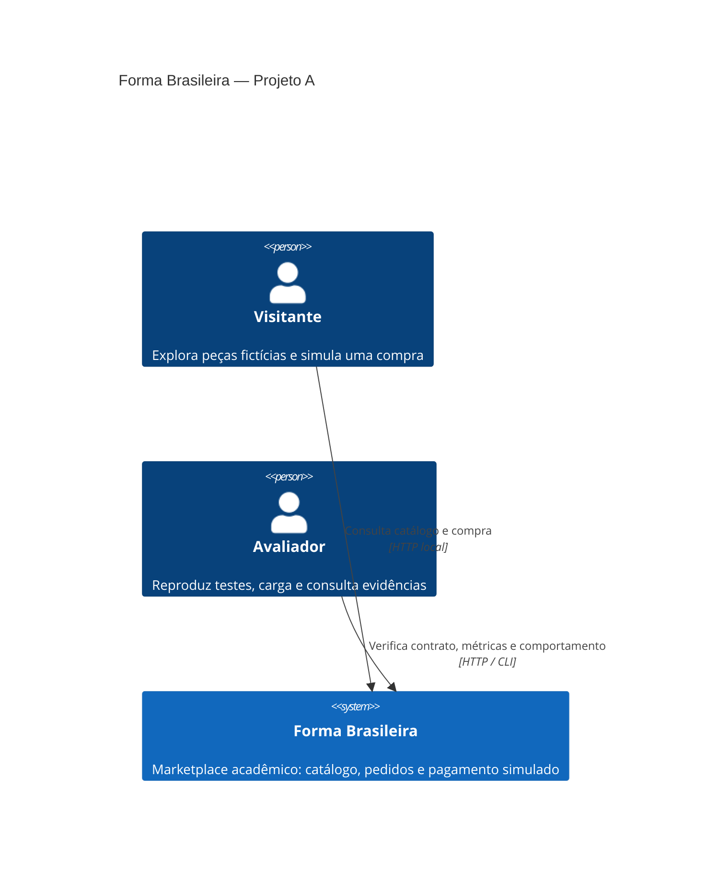

# C4 — contexto

```mermaid
C4Context
  title Forma Brasileira — Projeto A
  Person(cliente, "Visitante", "Explora peças fictícias e simula uma compra")
  Person(avaliador, "Avaliador", "Reproduz testes, carga e consulta evidências")
  System(forma, "Forma Brasileira", "Marketplace acadêmico: catálogo, pedidos e pagamento simulado")
  Rel(cliente, forma, "Consulta catálogo e compra", "HTTP local")
  Rel(avaliador, forma, "Verifica contrato, métricas e comportamento", "HTTP / CLI")
```

Não há gateway financeiro externo nem pagamento real.
